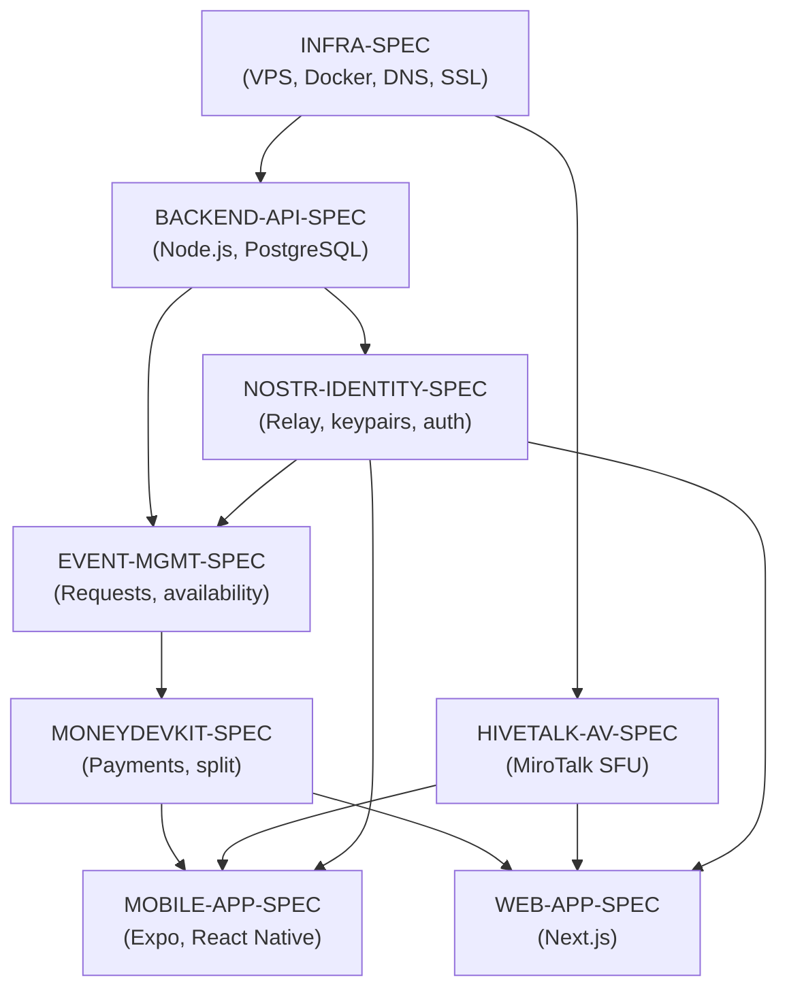

# Drumstr — Task Index

All tasks reference their parent spec. Execute in dependency order.

## Execution Order

## Task List

### Phase 1: Infrastructure
| # | Task | Spec | Status |
|---|---|---|---|
| 1.1 | Purchase Infomaniak VPS (Switzerland, 4 vCPU / 4GB) | INFRA-SPEC | ⬜ |
| 1.2 | Purchase Hetzner CX31 (Germany, 4 vCPU / 8GB) | INFRA-SPEC | ⬜ |
| 1.3 | Register drumstr.app domain | INFRA-SPEC | ⬜ |
| 1.4 | Configure Cloudflare DNS (all subdomains) | INFRA-SPEC | ⬜ |
| 1.5 | Run bootstrap-backend.sh on Infomaniak VPS | INFRA-SPEC | ⬜ |
| 1.6 | Run bootstrap-av.sh on Hetzner VPS | INFRA-SPEC | ⬜ |
| 1.7 | Initialize monorepo (pnpm + Turborepo) | INFRA-SPEC | ⬜ |
| 1.8 | Create GitHub repo + Actions CI/CD | INFRA-SPEC | ⬜ |

### Phase 2: A/V Server
| # | Task | Spec | Status |
|---|---|---|---|
| 2.1 | Research HiveTalk self-hosting docs | HIVETALK-AV-SPEC | ⬜ |
| 2.2 | Install MiroTalk SFU on Hetzner VPS | HIVETALK-AV-SPEC | ⬜ |
| 2.3 | Configure Nginx + SSL (av.drumstr.app) | HIVETALK-AV-SPEC | ⬜ |
| 2.4 | Configure port range for 100 users | HIVETALK-AV-SPEC | ⬜ |
| 2.5 | Verify room creation API endpoint | HIVETALK-AV-SPEC | ⬜ |
| 2.6 | Load test (100 simulated users) | HIVETALK-AV-SPEC | ⬜ |

### Phase 3: Backend API
| # | Task | Spec | Status |
|---|---|---|---|
| 3.1 | Initialize packages/api (Express, TypeScript, Prisma) | BACKEND-API-SPEC | ⬜ |
| 3.2 | Define Prisma schema and run initial migration | BACKEND-API-SPEC | ⬜ |
| 3.3 | Implement config.ts (Zod env validation) | BACKEND-API-SPEC | ⬜ |
| 3.4 | Implement auth routes (TDD) | BACKEND-API-SPEC | ⬜ |
| 3.5 | Implement user routes (TDD) | BACKEND-API-SPEC | ⬜ |
| 3.6 | Implement event + facilitator routes (TDD) | BACKEND-API-SPEC | ⬜ |
| 3.7 | Implement HiveTalk room creation service | BACKEND-API-SPEC | ⬜ |
| 3.8 | Implement Firebase notifications service | BACKEND-API-SPEC | ⬜ |
| 3.9 | Dockerize API + deploy to Infomaniak VPS | BACKEND-API-SPEC | ⬜ |

### Phase 4: Nostr Identity
| # | Task | Spec | Status |
|---|---|---|---|
| 4.1 | Initialize packages/nostr | NOSTR-IDENTITY-SPEC | ⬜ |
| 4.2 | Implement key generation (TDD) | NOSTR-IDENTITY-SPEC | ⬜ |
| 4.3 | Implement signing + NIP-98 auth (TDD) | NOSTR-IDENTITY-SPEC | ⬜ |
| 4.4 | Deploy nostr-rs-relay (relay.drumstr.app) | NOSTR-IDENTITY-SPEC | ⬜ |
| 4.5 | Integrate Nostr auth into backend API | NOSTR-IDENTITY-SPEC | ⬜ |

### Phase 5: Event Management
| # | Task | Spec | Status |
|---|---|---|---|
| 5.1 | Add preferredTime field migration | EVENT-MGMT-SPEC | ⬜ |
| 5.2 | Implement event request flow (TDD) | EVENT-MGMT-SPEC | ⬜ |
| 5.3 | Implement facilitator availability routes (TDD) | EVENT-MGMT-SPEC | ⬜ |
| 5.4 | Implement confirmEvent service (TDD) | EVENT-MGMT-SPEC | ⬜ |
| 5.5 | Implement 15-minute reminder cron job | EVENT-MGMT-SPEC | ⬜ |

### Phase 6: Payments
| # | Task | Spec | Status |
|---|---|---|---|
| 6.1 | Create MoneyDevKit account, save credentials | MONEYDEVKIT-SPEC | ⬜ |
| 6.2 | Implement checkout API route (Next.js) | MONEYDEVKIT-SPEC | ⬜ |
| 6.3 | Implement webhook verification + payment service (TDD) | MONEYDEVKIT-SPEC | ⬜ |
| 6.4 | Implement split routing (facilitator + DFE) | MONEYDEVKIT-SPEC | ⬜ |
| 6.5 | Implement facilitator wallet config endpoint | MONEYDEVKIT-SPEC | ⬜ |
| 6.6 | End-to-end payment test (testnet) | MONEYDEVKIT-SPEC | ⬜ |

### Phase 7: Web App
| # | Task | Spec | Status |
|---|---|---|---|
| 7.1 | Initialize apps/web (Next.js 15, Tailwind, shadcn/ui) | WEB-APP-SPEC | ⬜ |
| 7.2 | Implement NostrAuthContext + NIP-07 login (TDD) | WEB-APP-SPEC | ⬜ |
| 7.3 | Build Home page (events list) | WEB-APP-SPEC | ⬜ |
| 7.4 | Build Events and Event Detail pages | WEB-APP-SPEC | ⬜ |
| 7.5 | Build Facilitators + Request pages | WEB-APP-SPEC | ⬜ |
| 7.6 | Build checkout + success pages (MoneyDevKit) | WEB-APP-SPEC | ⬜ |
| 7.7 | Build Admin payment split page | WEB-APP-SPEC | ⬜ |
| 7.8 | Configure drumfreeexperience.org redirect | WEB-APP-SPEC | ⬜ |
| 7.9 | Deploy web app to Infomaniak VPS | WEB-APP-SPEC | ⬜ |

### Phase 8: Mobile App
| # | Task | Spec | Status |
|---|---|---|---|
| 8.1 | Initialize apps/mobile (Expo SDK 52, TypeScript) | MOBILE-APP-SPEC | ⬜ |
| 8.2 | Implement auth store (Nostr keypair + SecureStore) (TDD) | MOBILE-APP-SPEC | ⬜ |
| 8.3 | Build Welcome / onboarding screens | MOBILE-APP-SPEC | ⬜ |
| 8.4 | Build tab layout (Home, Explore, Request, Profile) | MOBILE-APP-SPEC | ⬜ |
| 8.5 | Build Event Detail + A/V Room (WebView) screens | MOBILE-APP-SPEC | ⬜ |
| 8.6 | Build Payment WebView (MoneyDevKit checkout) | MOBILE-APP-SPEC | ⬜ |
| 8.7 | Set up Firebase push notifications | MOBILE-APP-SPEC | ⬜ |
| 8.8 | Test on iOS Simulator + Android Emulator | MOBILE-APP-SPEC | ⬜ |
| 8.9 | Submit to App Store + Google Play (beta) | MOBILE-APP-SPEC | ⬜ |

---

## Monthly Infrastructure Cost Summary

| Service | Provider | Cost/mo (USD) |
|---|---|---|
| Backend VPS | Infomaniak (CH) | ~$10.50 |
| A/V VPS | Hetzner CX31 (DE) | ~$15.80 |
| CDN / DNS | Cloudflare | Free |
| Storage | Backblaze B2 | Free (≤10GB) |
| Notifications | Firebase Spark | Free |
| Payments | MoneyDevKit | Free (beta) |
| **Total** | | **~$26.30/mo** |

Domain: ~$10/yr (drumstr.app)
